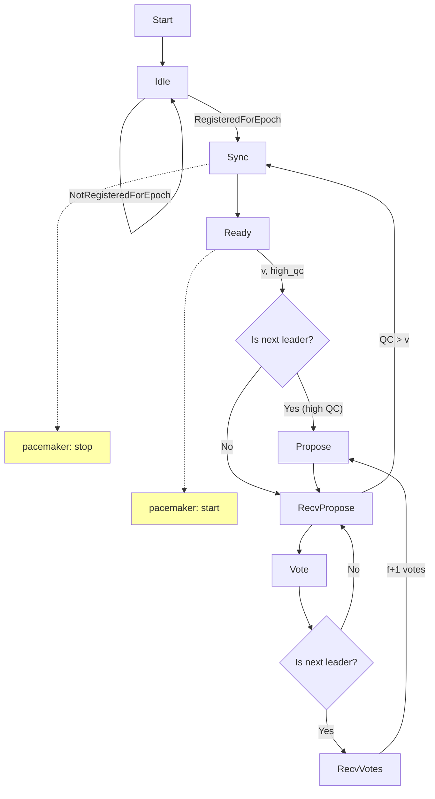

# Consensus state machine

```mermaid
flowchart TD
    Start --> Idle
    Idle -->|NotRegisteredForEpoch| Idle
    Idle -->|RegisteredForEpoch| Sync
    Sync --> Ready
    Ready -->|v, high_qc| Leader
    Ready -...-> N1["pacemaker: start"]
    Sync -...-> N2["pacemaker: stop"]
    
    Leader -->|"Yes (high QC)"| Propose
    RecvVotes -->|f+1 votes| Propose

    Leader -->|No| RecvPropose
    Propose --> RecvPropose
    RecvPropose --> Vote
    Vote -->Leader2
    Leader2 -->|Yes| RecvVotes
    Leader2 -->|No| RecvPropose

    RecvPropose -->|QC > v| Sync
    
    Leader{Is next leader?}
    Leader2{Is next leader?}

classDef Note fill:#ffa,color:#333;
N1:::Note
N2:::Note 
```
